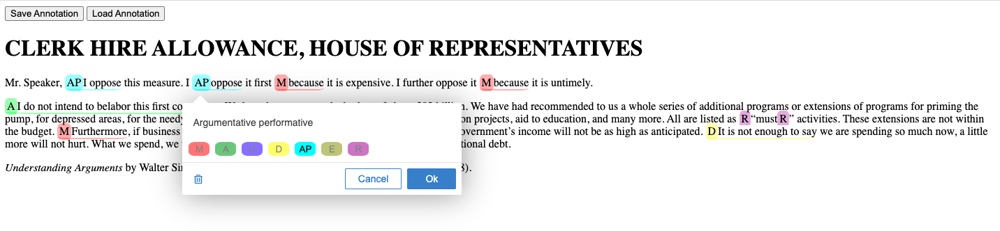

# reasan-annotation
 

 

## argument annotation
Recogito pracuje s typom Body anotacie "TextualBody". Defaultne pre tento typ ma nastaveny purpose "commenting/replaying" a "tagging". Tieto ucely pre anotovanie argumentacie mi neprisli vhodne, tak som vychadzal z toho, ze purpose argumentacnych anotacii je "describing" (je tu este moznost predefinovat purpose na "classifying"; moze to byt predmetom diskusie, no ak marker povazujem za (meta)opis casti textu, tak mi pride vhodnejsi "describing" purpose). Pri definovani purpose som vychadzal z [W3C Annotacneho modelu](https://www.w3.org/TR/annotation-model/), konkretne z ich [specifikacie Motivation a purpose](https://www.w3.org/TR/annotation-model/#motivation-and-purpose).

Body pre annotaciu Argument markera teda vyzera takto:
<pre>body: [{type: "TextualBody", 
        purpose: "describing", 
        value: "Argument marker"
}]</pre>

Pre takto specifikovane body som musel implementovat custom widget.

## implementacia custom widgetu
Kedze, defaultne ti [editor (pop-up okno) anotacie](https://recogito.github.io/guides/configuring-the-editor/) ponukne dve polia na vlozenie komentara alebo tagu, bolo treba prerobit cely editor pre vyssie specifikovane body na nase ucely. Editor je v recogito.js defaultne vyskladany z dvoch widgetov obsluhujucich kometujucu cast a tagujucu cast. Ani jeden z nich vsak nie je vhodny pre nasu specifikaciu, tak som ich vyhodil a implementoval som custom widget DescriptionSelectionWidget. Pri inicializacii recogito.sj je to ako hodnota v poli "widgets", ktore je sucastou objektu, ktory vkladas do init funkcie:
<pre>var r = Recogito.init({
	        	content: 'my-content',
	        	widgets: [
	        	    DescriptionSelectorWidget,
	        	  ],
	        	formatter: ColorFormatter
	      	});</pre>

Pri implementacii som vychadzal z [navodu na kodenie editor widgetu](https://recogito.github.io/guides/editor-widgets/). Isiel som podla neho v podstate a customizoval na to, co potrebujem. Teda nejake veci som prepisal a nejake doplnil uplne nove. Je to navod ako vyrobit custom widegt iba pomocou JS a HTML. Existuje aj sposob ako to urobit pomoco Reactu, ale ten som neskumal, kedze React nepoznam.

Logika za tym je taka, ze pri oznaceni textu ti vyskoci pop-up okno, kde si mozes vybrat descripciu, ktoru chces vlozit ako anotaciu. Deskripcia vychadza z <cite>Understanding arduments</cite>. Zaroven sa tato descripcia vypise v nazve anotacie. Cez ::before som potom v CSS vkladal tie znacky pre jednotlive descripcie pred anotovanu cast textu.

## ulozenie
Pridal som tam dve tlacitka Save/Load, ktore pracuju s local storage (pozri v Developer tool v prehliadaci zalozku Application/Local Storage/File). Mozno by bolo fajn prerobit to pre pracu s JSON file.

## misc
 - nechal som v texte nejake console.logy aby si si mohol v console pozriet, ako to pracuje v ramci datovej struktury anotacie aj kolekcie.
 - anotacie do kolekcie uklada podla zaciatku selectora. Zaciatok selectora je poradie znaku v texte, ktory je obaleny div wraperom, na ktory sa vztahuje recogito.js objekt. V kode to je: <pre>\
</pre> A anotacie teda uklada do kolekcie, podla tohto poradia - vyskytu v texte.
 - s JavasScriptom som davno nerobil, tak ten kod je kostrbaty :)
 - spisme co by sa dalo dalej dorobit a vylepsovat postupne
 
## TODOs

### Features

+ Anotacia indikatorov sily recovych aktov
+ Anotacia indikatorov propozicneho obsahu recovych aktov
+ Anotacia nespojitych indikatorov
+ Anotacia celeho recoveho aktu
+ Anotacia (argumentacnych) vztahov medzi recovymi aktami
+ Perzistencia anotacii (lokalna a/alebo cez webservis)
+ Vizual anotacii (podla *Understanding Arguments*)
+ Dialogy pre vytvaranie anotacii (napr. podla (hypothes.is)[https://web.hypothes.is/])
+ CMS pre anotovane texty (napr. cez pelican)

### Maintenance

+ Vyhodit JS a CSS do samostatnych suborov
+ Okomentovat JS skripty a CSS styly
